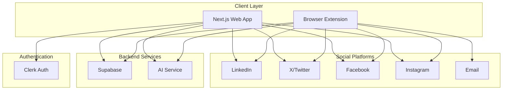

# Design Document

## Overview

HumanReplies is a comprehensive AI-powered social media assistant consisting of three main components:

1. **Next.js Web Application** - User authentication, account management, social media integration, and writing style analysis
2. **Browser Extension** - Platform-specific integrations for reply generation and posting
3. **Supabase Backend** - Cross-platform data persistence and user management

The system uses a cloud-first architecture where user data, writing styles, and preferences are stored centrally, allowing seamless access across different browsers and devices.

## Architecture

### High-Level Architecture



### Component Architecture

**Next.js Web Application:**
- Landing page with hero section and extension download
- User dashboard for account management
- Social media OAuth integration
- Writing style analysis and framework prompt generation
- Custom instruction management

**Browser Extension:**
- Content scripts for platform-specific DOM manipulation
- Background service worker for API communication
- Popup interface for quick settings and manual reply generation
- Platform-specific integration modules

**Supabase Backend:**
- User profiles and authentication data
- Social media account connections
- Writing style frameworks and custom instructions
- Usage analytics and reply history

## Components and Interfaces

### Web Application Components

#### Authentication System
- **Clerk Integration**: Handles user registration, login, and session management
- **Protected Routes**: Dashboard and account management pages require authentication
- **User Profile Management**: Basic profile information and preferences

#### Social Media Integration
- **OAuth Handlers**: Secure connection to LinkedIn, X, Facebook, Instagram APIs
- **Data Fetching**: Retrieve user's historical posts and comments for analysis
- **Connection Status**: Display connected accounts and manage permissions

#### Writing Style Analysis
- **Content Analyzer**: Process historical social media content to identify patterns
- **Framework Generator**: Create personalized prompts based on writing analysis
- **Custom Instructions**: Allow manual input of tone and style preferences
- **Preview System**: Show examples of generated content with current settings

#### Dashboard Interface
- **Account Overview**: Connected platforms, analysis status, usage statistics
- **Style Management**: View and edit framework prompts and custom instructions
- **Extension Status**: Check browser extension connection and sync status

### Browser Extension Components

#### Content Scripts
- **Platform Detection**: Identify current social media platform
- **DOM Injection**: Insert reply assistance UI into platform interfaces
- **Context Extraction**: Parse post content, comments, and conversation context
- **Reply Integration**: Seamlessly integrate generated replies into platform posting flows

#### Background Service Worker
- **API Communication**: Handle requests to Supabase and AI services
- **Data Synchronization**: Keep user preferences and style frameworks updated
- **Cross-Tab Communication**: Coordinate between multiple platform tabs

#### Platform-Specific Modules
- **LinkedIn Module**: Handle LinkedIn's specific DOM structure and posting API
- **X/Twitter Module**: Manage character limits and threading functionality
- **Facebook Module**: Navigate Facebook's complex interface and privacy settings
- **Instagram Module**: Handle Instagram's mobile-first design patterns
- **Email Module**: Integrate with Gmail, Outlook, and other email providers

#### Popup Interface
- **Quick Settings**: Toggle extension on/off, select reply optimization goals
- **Manual Generation**: Generate replies for copied content outside supported platforms
- **Sync Status**: Display connection status with web application

### AI Integration

#### Reply Generation Service
- **Context Analysis**: Parse original content for tone, intent, and engagement opportunities
- **Style Application**: Apply user's framework prompt to maintain authentic voice
- **Variation Generation**: Create primary reply plus two alternatives with different optimization goals
- **Platform Adaptation**: Adjust content for platform-specific constraints and norms

#### Learning System
- **Feedback Integration**: Learn from user edits and selections to improve future generations
- **Pattern Recognition**: Identify successful engagement strategies from user's reply history
- **Continuous Improvement**: Update framework prompts based on user behavior and preferences

## Data Models

### User Profile
```typescript
interface UserProfile {
  id: string;
  clerk_user_id: string;
  email: string;
  created_at: timestamp;
  updated_at: timestamp;
  subscription_tier: 'free' | 'premium';
  preferences: UserPreferences;
}

interface UserPreferences {
  default_optimization: 'engagement' | 'relationship' | 'lead_generation';
  auto_post: boolean;
  platforms_enabled: string[];
  notification_settings: NotificationSettings;
}
```

### Social Media Connection
```typescript
interface SocialConnection {
  id: string;
  user_id: string;
  platform: 'linkedin' | 'twitter' | 'facebook' | 'instagram';
  platform_user_id: string;
  access_token: string; // encrypted
  refresh_token: string; // encrypted
  connected_at: timestamp;
  last_sync: timestamp;
  is_active: boolean;
  permissions: string[];
}
```

### Writing Style Framework
```typescript
interface WritingFramework {
  id: string;
  user_id: string;
  framework_prompt: string;
  custom_instructions: string;
  analysis_data: AnalysisData;
  created_at: timestamp;
  updated_at: timestamp;
  version: number;
}

interface AnalysisData {
  tone_characteristics: string[];
  vocabulary_patterns: string[];
  sentence_structure: string;
  engagement_style: string;
  platform_adaptations: Record<string, PlatformStyle>;
}
```

### Reply History
```typescript
interface ReplyHistory {
  id: string;
  user_id: string;
  platform: string;
  original_content: string;
  generated_replies: GeneratedReply[];
  selected_reply: string;
  user_edits: string;
  posted_at: timestamp;
  engagement_metrics: EngagementMetrics;
}

interface GeneratedReply {
  content: string;
  optimization_goal: string;
  confidence_score: number;
}
```

## Error Handling

### Web Application Error Handling
- **Authentication Errors**: Graceful handling of Clerk authentication failures with retry mechanisms
- **API Rate Limits**: Implement exponential backoff for social media API calls
- **Network Failures**: Offline support with local caching and sync when connection restored
- **Data Validation**: Client and server-side validation with user-friendly error messages

### Browser Extension Error Handling
- **Platform Changes**: Robust DOM selectors with fallback strategies for platform updates
- **Permission Errors**: Clear messaging when social media platforms deny access
- **Sync Failures**: Local storage backup with periodic retry for cloud synchronization
- **Content Generation Errors**: Fallback to simpler reply generation when AI service fails

### Data Integrity
- **Encryption**: All sensitive tokens and user data encrypted at rest and in transit
- **Backup Systems**: Regular automated backups of user frameworks and preferences
- **Rollback Capability**: Version control for writing frameworks with rollback options
- **Data Validation**: Comprehensive validation at API boundaries and database level

## Testing Strategy

### Unit Testing
- **Component Testing**: React components with Jest and React Testing Library
- **Service Testing**: API endpoints and business logic with comprehensive test coverage
- **Extension Testing**: Content scripts and background workers with Chrome extension testing framework

### Integration Testing
- **API Integration**: End-to-end testing of Supabase and social media API integrations
- **Authentication Flow**: Complete user registration and login workflows
- **Cross-Platform Sync**: Data synchronization between web app and extension

### End-to-End Testing
- **User Workflows**: Complete user journeys from registration to reply generation
- **Platform Testing**: Automated testing on actual social media platforms in controlled environments
- **Performance Testing**: Load testing for concurrent users and API rate limits

### Browser Extension Testing
- **Cross-Browser Compatibility**: Testing on Chrome, Firefox, Safari, and Edge
- **Platform Compatibility**: Verification across different social media platform versions
- **Permission Testing**: Various permission scenarios and user consent flows

### Security Testing
- **Authentication Security**: OAuth flow security and token management
- **Data Protection**: Encryption verification and secure data transmission
- **Extension Security**: Content Security Policy compliance and XSS prevention
- **API Security**: Rate limiting, input validation, and authorization testing

## Performance Considerations

### Web Application Performance
- **Next.js Optimization**: Static generation for landing pages, server-side rendering for dynamic content
- **Image Optimization**: Automatic image optimization and lazy loading
- **Code Splitting**: Route-based code splitting to minimize initial bundle size
- **Caching Strategy**: Aggressive caching for static assets and API responses

### Browser Extension Performance
- **Minimal Resource Usage**: Lightweight content scripts with lazy loading
- **Efficient DOM Manipulation**: Optimized selectors and minimal DOM queries
- **Background Processing**: Offload heavy computations to background service worker
- **Memory Management**: Proper cleanup of event listeners and cached data

### Database Performance
- **Query Optimization**: Indexed queries and efficient data retrieval patterns
- **Connection Pooling**: Supabase connection optimization for concurrent users
- **Data Archiving**: Archive old reply history to maintain performance
- **Real-time Subscriptions**: Efficient real-time updates for cross-device synchronization

## Security Architecture

### Authentication & Authorization
- **Clerk Integration**: Industry-standard authentication with MFA support
- **JWT Tokens**: Secure token-based authentication with proper expiration
- **Role-Based Access**: User permissions and subscription tier enforcement
- **Session Management**: Secure session handling with automatic logout

### Data Protection
- **Encryption at Rest**: All sensitive data encrypted in Supabase
- **Encryption in Transit**: HTTPS/TLS for all API communications
- **Token Security**: OAuth tokens encrypted and stored securely
- **PII Protection**: Minimal collection and secure handling of personal information

### Browser Extension Security
- **Content Security Policy**: Strict CSP to prevent XSS attacks
- **Permission Model**: Minimal required permissions with user consent
- **Secure Communication**: Encrypted communication between extension components
- **Code Integrity**: Signed extension packages and integrity verification