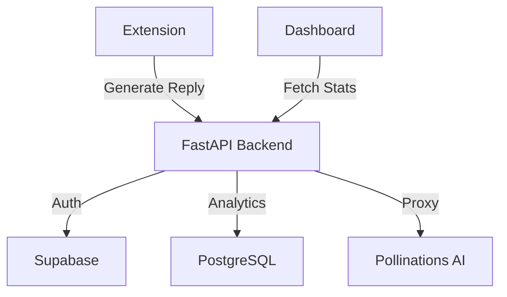

# HumanReplies

AI-powered reply generation for social media. Built for quick, contextual, and customizable responses — with a Chrome extension, FastAPI backend, and analytics dashboard (Next.js).

[](LICENSE)

---

## 🏗️ Project Structure

```
HumanReplies/
├── browser-extension/   # Chrome extension (Manifest V3)
├── backend/             # FastAPI + PostgreSQL + Supabase
├── dashboard/           # Next.js analytics
└── README.md
```

---

## 🚀 Quick Start

### Backend

```bash
cd backend
./setup.sh        # macOS/Linux
setup.bat         # Windows
# Or manual setup
python -m venv .venv && source .venv/bin/activate
pip install -r requirements.txt
python run.py     # http://localhost:8000
```

**Requires**: Python 3.9+, PostgreSQL, Supabase (`.env` with credentials).

👉 For full installation and setup details, see [INSTALL.md](INSTALL.md).

### Extension

```bash
cd browser-extension
# Load unpacked in Chrome:
# chrome://extensions → Developer mode → Load unpacked
```

### Dashboard

```bash
cd dashboard
npm install
npm run dev   # http://localhost:3000
```

---

## ✨ Key Features

### Extension

- 🧠 **AI Replies**: Context-aware, one-click responses
- 🎨 **Tones**: Preset + custom tones (e.g. neutral, funny, supportive)
- 🔐 **Supabase Auth**: Secure login & token refresh
- 📊 **Reply Tracking**: Analytics synced to dashboard

### Backend

- ⚡ **FastAPI + PostgreSQL** with async SQLAlchemy
- 🔐 **Supabase JWT** authentication
- 📝 **Minimal Data Storage**: Logs timestamp + platform only (no post content)
- 🎨 **Tone API**: Presets + user-defined tones
- 📊 **Privacy-First Analytics**

### Dashboard

- 📈 Usage stats (daily/weekly/monthly)
- 📊 Service breakdown (X, LinkedIn, Facebook)
- ⚙️ Settings & tone management
- 🌓 Dark/light mode

---

## 🔧 Tech Stack

- **Extension**: Manifest V3, Vanilla JS
- **Backend**: FastAPI, PostgreSQL, Supabase, SQLAlchemy, Alembic
- **Dashboard**: Next.js 14, React 18, TypeScript

---

## 🛡️ Privacy & Security

HumanReplies **do not store content**.  
❌ Original posts  
❌ Generated replies  
❌ Post URLs

HumanReplies only log minimal analytics:  
✅ Timestamp  
✅ (Optional) User ID

Authentication is handled via Supabase JWT with row-level security.

---

## 🔄 Architecture



---

## 🧩 Example API Endpoints

- `POST /api/v1/services/generate-reply` → Generate reply
- `GET /api/v1/tones/` → Fetch tones (presets + custom)
- `POST /api/v1/tones/` → Create custom tone
- `GET /api/v1/replies/stats` → Fetch analytics

### Pollinations API

This project relies on the **Pollinations API** for generating AI-powered replies. The Pollinations API provides advanced AI capabilities that enable contextual and dynamic reply generation.

For more information about the Pollinations API, visit their [official website](https://pollinations.ai/).

---

## 📝 License

MIT License © 2025 HumanReplies

---

**Built with ❤️ for better social media interactions.**
